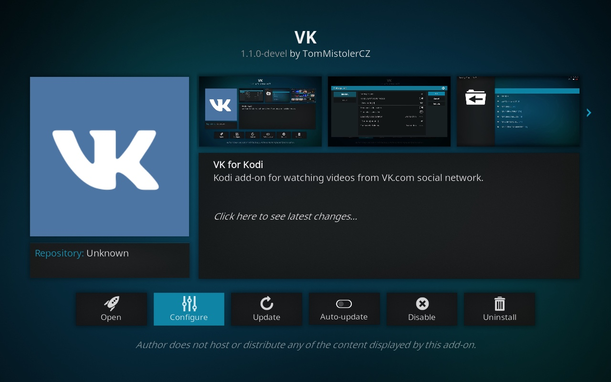
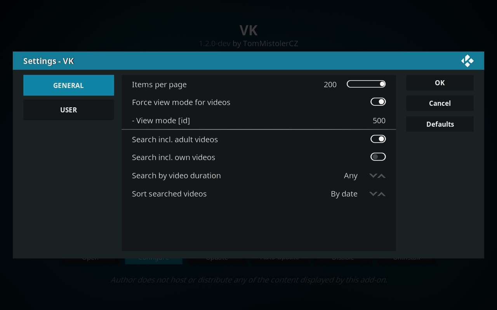
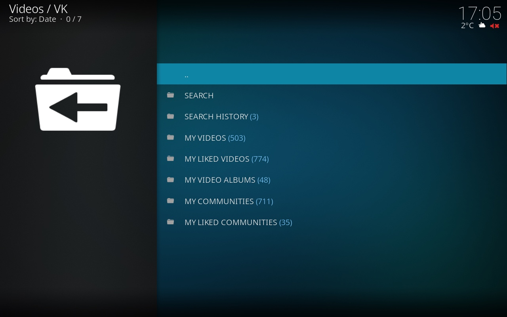
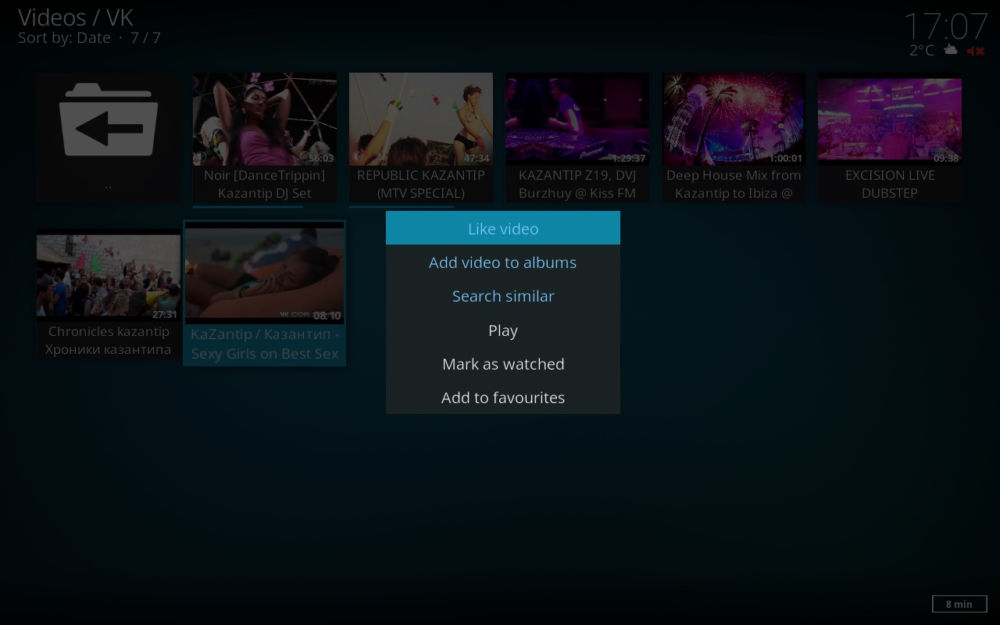

# VK (plugin.video.vk)

Kodi add-on for watching videos from VK.com social network.

- [Requirements](#requirements)
- [Installation](#installation)
- [Features and changelog](#features-and-changelog)
- [Screenshots](#screenshots)

## Requirements

- [Kodi](https://kodi.tv) v17+ installed
- [VK.com](https://vk.com) user account

## Installation

1. Download the add-on zip file: 
    [plugin.video.vk-1.2.0-dev.zip](https://github.com/tommistolercz/plugin.video.vk/releases/download/v1.2.0-dev/plugin.video.vk-1.2.0-dev.zip)
    
2. Install it in Kodi: 
    `Kodi > Settings > Add-ons > Install from zip file...`

    [How to install add-ons from zip files](https://kodi.wiki/view/HOW-TO:Install_add-ons_from_zip_files)

## Features and changelog

### Future
- [ ] Fix /playvideo raising video resolving error due to unhandled cookies expiration (#57)
- [ ] Fix /addvideotoalbums only showing first 100 albums
- [ ] Add /clearhistory context action for /playedvideos, /searchhistory
- [ ] Add /searchhistory pagination
- [ ] Add /playedvideos pagination

### v1.2.0-dev (not yet released)

- [ ] Fix unicode issues:
    - [x] Added type hints for all methods
    - [ ] Fix weak encoding error in menu (search history item)
    - [ ] Fix reported unicode issues (#66) (#70)
    - [ ] ...
- [ ] Fix content refreshing issues:
    - [ ] Fix main menu counters refreshing
    - [ ] Fix /searchvideos?offset=0 container refresh issues
    - [ ] Fix reported various issues related to container.refresh (#69)
    - [ ] ...
- [ ] Fix /createalbum not accessible if user has any albums yet
- [ ] Fix /playedvideos sorting (by lastPlayed)
- [x] Added /playedvideos list
- [x] Added /searchvideos context action into all lists types
- [x] Refactored add-on file structure and python code

### v1.1.0 (2019-02-01)

- [x] Fixed unicode issues
- [x] Fixed content refreshing after contextual actions
- [x] Fixed pagination bug
- [x] Fixed itemsperpage setting bug
- [x] Fixed Logout user button visibility bug 
- [x] Added info-labels showing video resolution in lists
- [x] Added counter for Search history in menu
- [x] Added code enabling Addict stats future feature
- [x] Reduced using of Kodi notifications
- [x] Utilized TinyDB for persisting add-on data
- [x] Refined complete python code
- [x] Refined language resources
- [x] Renamed cookies data file to be non-hidden

### v1.0.0 (2018-11-12)

Common:
- [x] EN/CZ language version
- [x] Manage add-on settings
- [x] Authorize add-on
- [x] List menu
- [x] Logout user

Search history:
- [x] List search history
- [x] Delete search

Videos:
- [x] Search videos
- [x] Search similar videos
- [x] List videos
- [x] List liked videos
- [x] List album videos
- [x] List community videos
- [x] Play video
- [x] Like video
- [x] Unlike video
- [x] Add video to albums

Video albums:
- [x] List albums
- [x] Rename album
- [x] Reorder album up/down
- [x] Delete album
- [x] Create new album

Communities:
- [x] List communities
- [x] List liked communities
- [x] Like community
- [x] Unlike community
- [x] Unfollow community

## Screenshots

