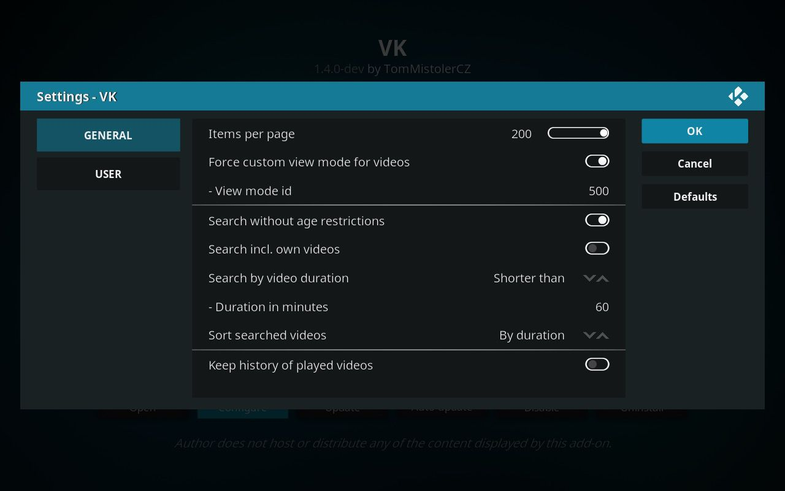
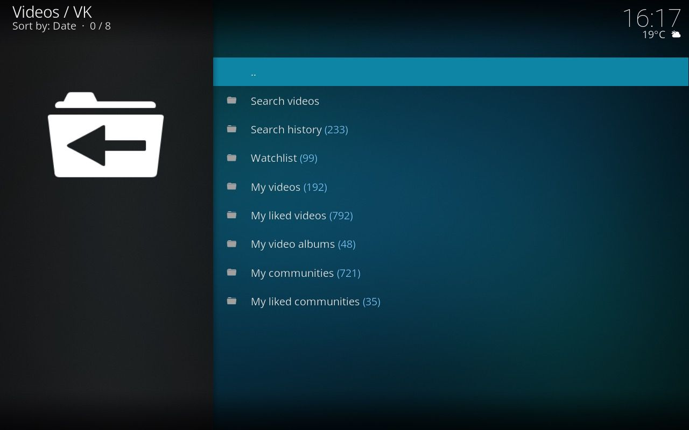

# VK (plugin.video.vk)

#### Kodi add-on for watching videos from VK.com social network.

 
 
 

- [Requirements](#requirements)
- [Installation](#installation)
- [Features](#features)
- [Changelog](#changelog)
- [Screenshots](#screenshots)
- [Author & Contributors](#author--contributors)

## Requirements

- [Kodi](https://kodi.tv) v17+ (v19+ also supported)
- [VK.com](https://vk.com) user account

## Installation

1. Download the add-on zip file: 
    [Latest release](https://github.com/tommistolercz/plugin.video.vk/releases/latest)
    
2. Install in Kodi: 
    `Kodi → Settings → Add-ons → Install from zip file...` 
    [How to install add-ons from zip files](https://kodi.wiki/view/HOW-TO:Install_add-ons_from_zip_files)

Note: You can also install this add-on from [repository.tommistolercz](https://github.com/tommistolercz/repository.tommistolercz). 
With this method, the add-on will auto-update when there is a new version available.

## Features

Translations:
- English, Russian, Czech

Settings:
- Items per page
- Force custom view mode for videos
- Search without age restrictions
- Search incl. own videos
- Search by video duration (any, longer/shorter than)
- Sort searched videos (by relevance, date, duration)
- Keep history of add-on requests (hidden)
- Keep history of played videos
- Prefer HLS (adaptive bitrate)
- VK user login (email/phone)
- VK user password

Common:
- Authorize add-on
- Logout user
- List add-on menu
- Skip to page nr.

Search:
- Search videos
- Search videos by similar title 
- List search history
- Delete search from history
- Clear search history

Videos:
- List my videos
- List my liked videos
- List album videos
- List community videos
- List played videos
- Clear played videos
- List watchlist
- Add video to watchlist
- Remove video from watchlist
- Clear watchlist
- Play video
- Like video
- Unlike video
- Set albums for video
- Go to (owning) community

Video albums:
- List my video albums
- Rename album
- Reorder album up/down
- Delete album
- Create new album

Communities:
- List my communities
- List my liked communities
- Like community
- Unlike community
- Follow community
- Unfollow community

## Changelog

[CHANGELOG](CHANGELOG.md) (incl. backlog with future features & ideas)

## Screenshots

## Author & Contributors 

- [TomMistolerCZ](https://github.com/tommistolercz)
- Владимир Малявин (RU translation)
