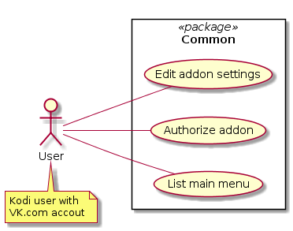
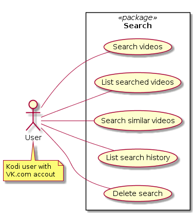
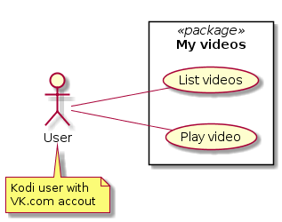
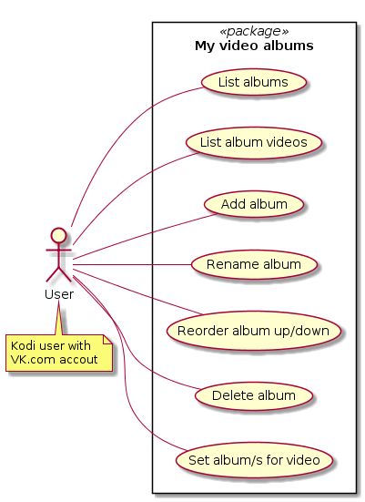
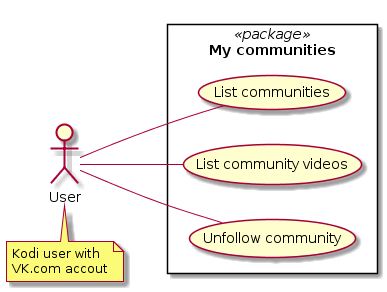
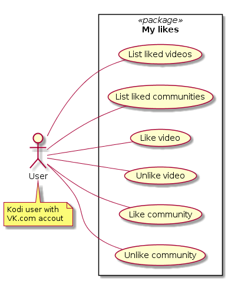
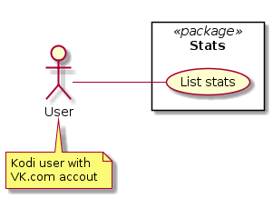
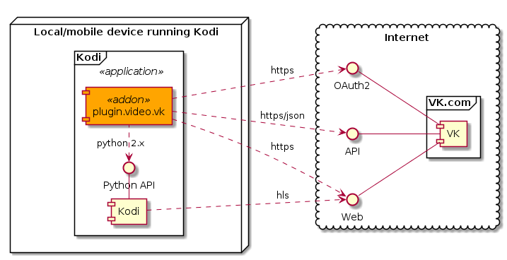
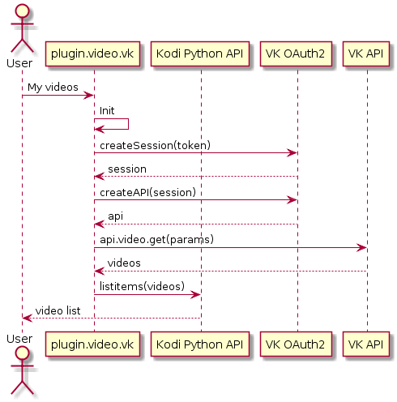

# DOCS for VK (plugin.video.vk)

## 1. Usecase view

## 2. Logical data view

...

## 3. Component view

### 3.1. Kodi Python API

- Kodi Python API docs: <https://codedocs.xyz/AlwinEsch/kodi/group__python.html>

### 3.2. VK OAuth2, VK API

A 3rd party [VK API Python wrapper](https://github.com/voronind/vk) is utilized for easier integration with VK API and VK OAuth2 service.

- VK API Python wrapper docs: <https://vk.readthedocs.io/en/latest/>
- VK API docs: <https://vk.com/dev/manuals>
- VK API methods: <https://vk.com/dev/methods>

## 4. Sequence view

